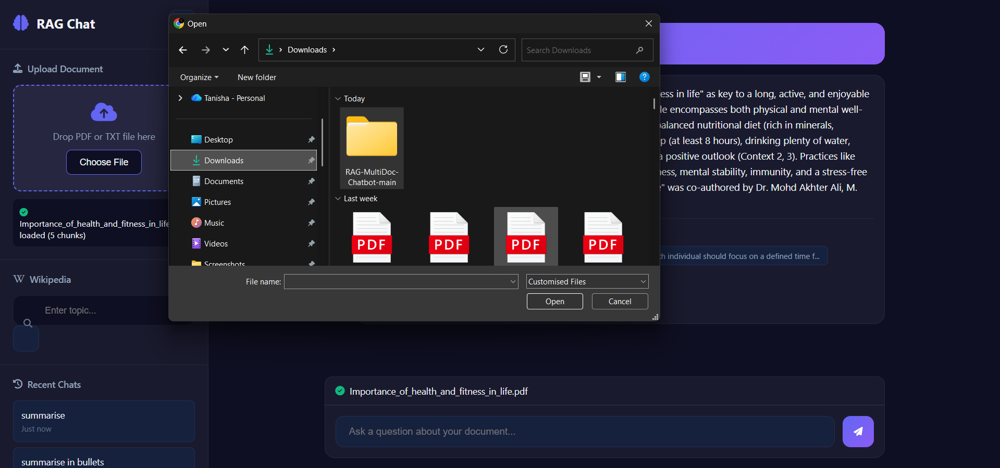
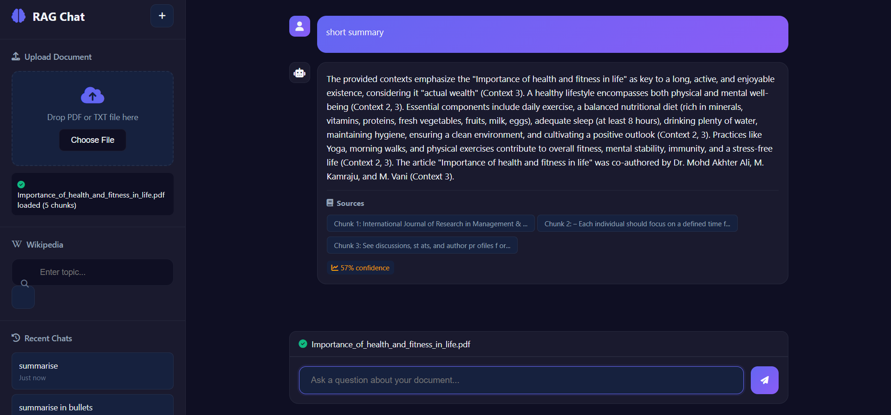

# RAG Chat Application

A Retrieval-Augmented Generation chat system powered by Google Gemini AI. Upload documents or load Wikipedia articles to ask questions and receive context-aware answers.




## Features

- Document upload support (PDF, TXT)
- Wikipedia article integration
- Semantic search with vector embeddings
- Context-aware question answering
- Chat history tracking
- Confidence scoring and source attribution

## Technology

- Backend: FastAPI, Python 3.8+
- Frontend: HTML, CSS, JavaScript
- AI: Google Gemini 2.5 Flash, Text Embedding 004
- Search: Cosine similarity with scikit-learn

## Setup Instructions

### 1. Create Virtual Environment

Windows:
```bash
python -m venv venv
venv\Scripts\activate
```

### 2. Install Dependencies
```bash
pip install fastapi uvicorn python-multipart python-dotenv google-generativeai PyPDF2 numpy scikit-learn wikipedia-api
```

### 3. Configure API Key

Create a `.env` file in the project root:
```
GEMINI_API_KEY=your_api_key_here
```

Get your API key from https://aistudio.google.com/api-keys

### 4. Start Backend Server
```bash
uvicorn app:app --host 0.0.0.0 --port 8000 --reload
```

The API will run on http://localhost:8000

### 5. Start Frontend Server

Using VS Code Live Server:
- Install Live Server extension
- Right-click `index.html`
- Select "Open with Live Server"

Or using Python:
```bash
python -m http.server 5500
```

Access the application at http://localhost:5500

## Usage

1. Upload a document or enter a Wikipedia topic
2. Wait for processing to complete
3. Type questions in the chat interface
4. View answers with confidence scores and source references

## API Endpoints
```
GET  /                              Health check
POST /api/documents/upload          Upload document
POST /api/documents/wikipedia       Load Wikipedia article
POST /api/query                     Submit question
GET  /api/history                   Retrieve chat history
GET  /api/status                    System status
```


## Documentation

- Google Gemini API: https://ai.google.dev/
- FastAPI: https://fastapi.tiangolo.com/


